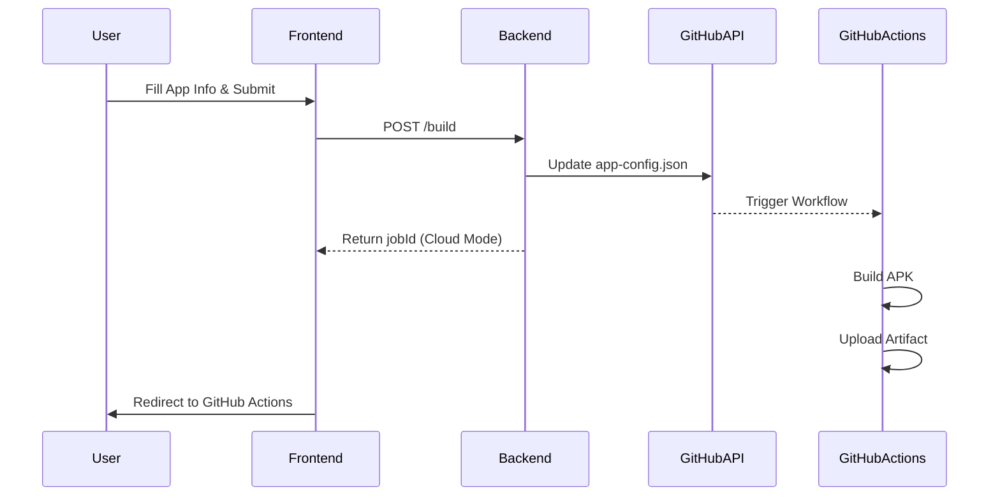

# Architecture & Build Pipeline 🏗️

This document explains the internal workings of the AppForge toolchain, specifically how it handles builds in both local and cloud modes.

## 1. System Components

### Frontend (React + Vite)
- The main entry point for users.
- Communicates with the backend via REST APIs.
- Listens to build/analysis progress via **Server-Sent Events (SSE)** to provide real-time log feedback.

### Backend (Node.js + Express)
- Orchestrates the build process.
- Features a **Job Manager** that tracks each build/analysis request with a unique UUID.
- Manages temporary build directories and automated cleanup.

## 2. The Build Pipeline

### Local Build Mode
When `GITHUB_TOKEN` is not configured, the server runs builds locally:
1. **Workspace Setup**: Creates a unique directory in `builds/`.
2. **Template Patching**: Copies `backend/android-template` and patches `strings.xml`, `AndroidManifest.xml`, and `build.gradle.kts` with the user-provided URL, name, and package.
3. **Execution**: Spawns a Gradle process (`./gradlew assembleDebug`).
4. **Log Streaming**: Captures Gradle's stdout/stderr and streams it to the frontend via SSE.
5. **Collection**: Detects the generated `.apk` and prepares it for download.

### Cloud Build Mode (GitHub Relay)
When `GITHUB_TOKEN` is present, the server acts as a **Relay**:
1. **Config Update**: The server writes the build configuration (URL, App Name, Package) to `app-config.json` in the GitHub repository using the GitHub API (Octokit).
2. **Trigger**: GitHub detects the commit (or workflow dispatch) and triggers the `generate-apk.yml` workflow.
3. **External Build**: GitHub Actions runners (Ubuntu) perform the heavy lifting (JDK setup, Gradle build).
4. **Result**: The final APK is uploaded as a GitHub Action artifact.

## 3. Decompilation Pipeline
Uses **Apktool** to analyze existing APKs:
1. **Upload**: User uploads an APK.
2. **Extract**: Server runs `java -jar apktool.jar d <apk>`.
3. **Zip**: The resulting files are zipped into a `.zip` archive.
4. **Download**: The user downloads the source code bundle.

## 4. Sequence Diagram (Relay Mode)

